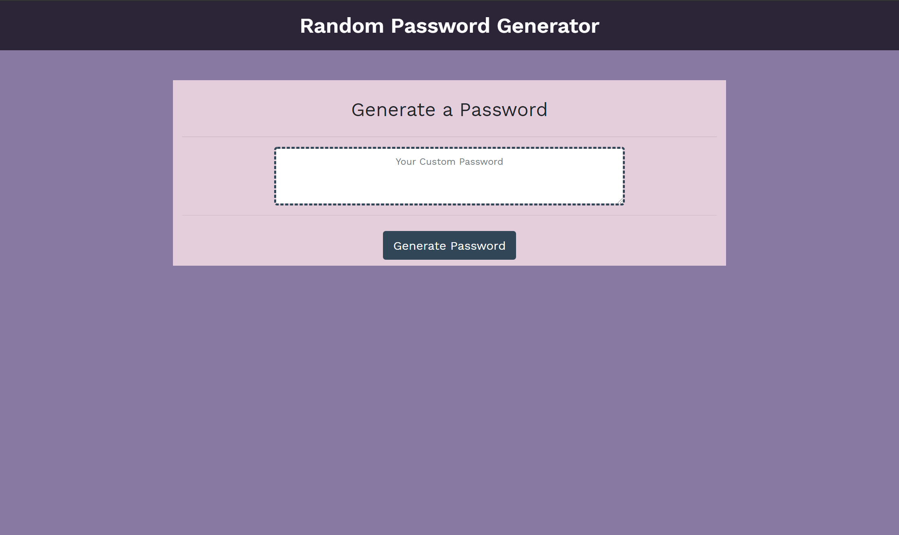
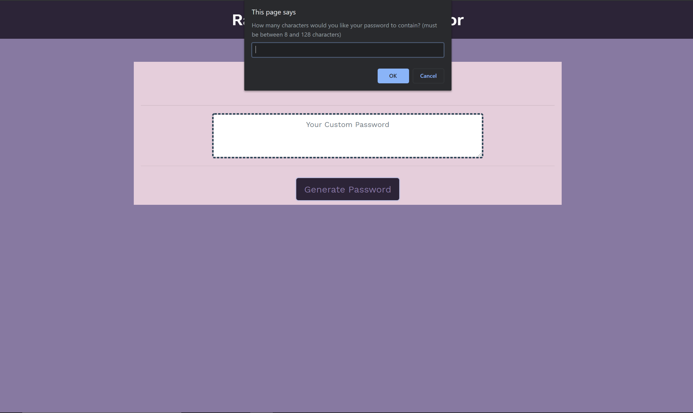
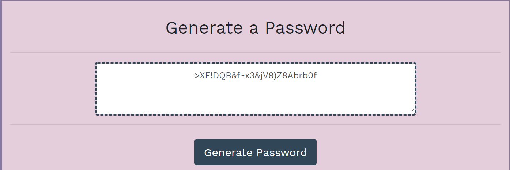

# Random Password Generator

## Description
This is a responsive website application that generates a randomized password using certain character types for a user, which is then displayed on screen for the user.

### Features
* Responsive layout using Bootstrap column/grid system.
* Site structure, styling, and programming built with HTML5, Bootstrap 4, CSS3, and JavaScript.
* User's are able to create a password of at least 8 characters and up to 128 characters.
* Character categories for user's selection include:
    * Specialized characters (~!@#$%^&*(){};:<>/?=+)
    * Lower case letters
    * Upper case letters
    * Numbers
* On screen display of generated password for user to copy/save somewhere.

### How it Works
##### See below for URL
On the click of the "Generate Button" on the user's screen a series of prompts/confirms that gather the user's desired password character length and desired character type are shown. These outcomes are then concated into an array that contains their selected character types. Finally when password meets the requried password character lengths, it is looped over the number of desired characters and random characters are generated from the concated array for a final new password to be displayed in the textarea on screen.

## URL 

### https://gheptig.github.io/password-generator/

## Preview Screenshots

## Contributers/Authors

Augustus Heptig - [Link to GitHub Profile](https://github.com/gheptig)